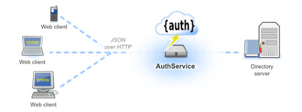

# Auth Service

**Authentication Workflow**  
The authentication flow is simple as:

1. The user sends a request to get a token passing his credentials.
2. The server validates the credentials and sends back a token.
3. With every request, the user has to provide the token, and server will validate that token.

\*\*\*\*





Login User



Log user in to the system with username and password, give him a new token after authentication


















Successfully login users


```text
{
  "token": "string",
  "user": {
    "email": "string",
    "id": "string",
    "role": "ADMIN",
    "username": "string"
  }
}
```







```
Invalid credential
```







```
Other internal errors
```







Logout user



Logout from the system and delete the token











```
Successfully logout user
```







```
Bad request
```







```
Other internal errors
```





