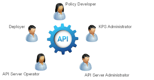

# User Service

User data in the system





Update user password by id 



This endpoint allows you to create user






ID of the cake to get, for free of course.





Authentication token to track down who is emptying our stocks.
















```
{
  "email": "string",
  "id": "string",
  "name": {
    "first": "string",
    "last": "string",
    "middle": "string"
  },
  "username": "string"
}
```







```
Bad Request
```







```
You are not authorized to view the resource
```







```
Accessing the resource you were trying to reach is forbidden
```







```
User not found
```







```

```





