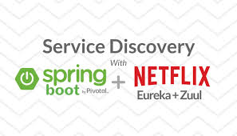

# Discovery Service/Eureka Server

**Eureka Server is also known as Discovery Server.**  
Eureka Server is an application that holds the information about all client-service applications.   
Every Micro service will register into the Eureka server and Eureka server knows all the client applications running on each port and IP address.

Eureka Server comes with the bundle of Spring Cloud. For this, we need to develop the Eureka server and run it on the default **port 8761**.  
The @EnableEurekaServer annotation used to make your Spring Boot application acts as a Eureka Server.

 To include Eureka Server in your project, use the starter with a group ID of `org.springframework.cloud` and an artifact ID of `spring-cloud-starter-netflix-eureka-server`

### Securing The Eureka Server

You can secure your Eureka server simply by adding Spring Security to your server’s classpath via `spring-boot-starter-security`

