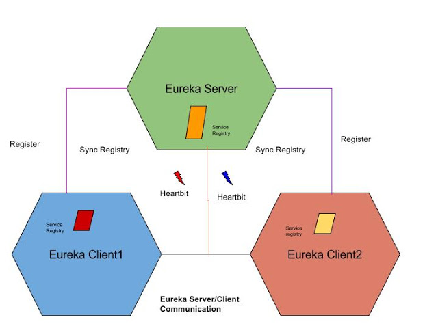

# Eureka Client

Gradle users can add the following dependencies into the **build.gradle** file −

```text
compile('org.springframework.cloud:spring-cloud-starter-eureka')
```

Need to add the **@EnableEurekaClient** annotation in the main Spring Boot application class file. The @EnableEurekaClient annotation makes your Spring Boot application act as a Eureka client.

To register the Spring Boot application into Eureka Server we need to add the following configuration in our application.properties file or application.yml file and specify the Eureka Server URL in our configuration.

```text
eureka:
   client:
      serviceUrl:
         defaultZone: http://localhost:8761/eureka

spring:
   application:
      name: eurekaclient
```



