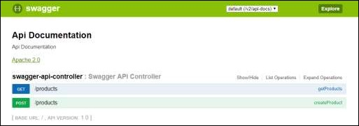

# Swagger

Swagger2 is an open source project used to generate the REST API documents for RESTful web services. It provides a user interface to access our RESTful web services via the web browser.

To enable the Swagger2 in Spring Boot application, you need to add the following dependencies in our build configurations file:

```text
compile group: 'io.springfox', name: 'springfox-swagger2', version: '2.7.0'
compile group: 'io.springfox', name: 'springfox-swagger-ui', version: '2.7.0'
```

Add the @EnableSwagger2 annotation in your main Spring Boot application. The @EnableSwagger2 annotation is used to enable the Swagger2 for your Spring Boot application.

Hit the URL in your web browser and see the Swagger API functionalities.

**http://localhost:8080/swagger-ui.html**



